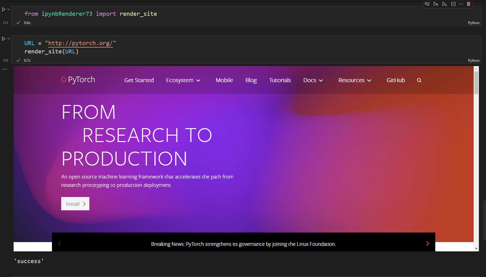

# Project: This is a ipynbRenderer73 Pypi package

This package is meant to render Youtube tutorial videos and reference site into the Colab or Jupyter notebooks for easy reference in future.

PYPI link for this package - [ipynbRenderer73](https://pypi.org/project/ipynbRenderer73/)

# How to run?
## Installation:

#### Create a conda environment

```bash
conda create -n renderer python=3.x -y
```

```bash
conda activate renderer
```

Now install using pip

```bash
pip install ipynbRenderer73
```


# Demo:
## For Youtube videos


## For Websites



# API reference

## Rendering Youtube videos

"example"

```python
from IPYNBrenderer import render_YouTube_video
URL = "https://youtu.be/roO5VGxOw2s"
render_YouTube_video(URL=URL, width = 780, height = 480)
```

| Args   | Type | Description | 
|:--------:|:------:|:-------|
| URL    | str |input URL of a youtube video as a string |
| height | int |height of the video to display in jupyter notebook, defaults to 720 |
| width  | int |width of the video to display in jupyter notebook, defaults to 600 | 

| Returns   |Type | Description | 
|:--------:|:--------:|:-----|
| Response    |  str   | "success" or InvalidURLException       |


## Rendering reference website

"example"
  
```python
from IPYNBrenderer import render_site
URL = "http://pytorch.org/"
render_site(URL = URL, width = "90%", height = "500")
```

| Args   | Type | Description | 
|:--------:|:------:|:-------|
| URL    | str |input URL of a youtube video as a string |
| height | str |height of the website to display in jupyter notebook, defaults to "600" |
| width  | str |width of the website to display in jupyter notebook, defaults to "100%" | 

| Returns   |Type | Description | 
|:--------:|:--------:|:-----|
| Response    |  str   | "success" or InvalidURLException       |


