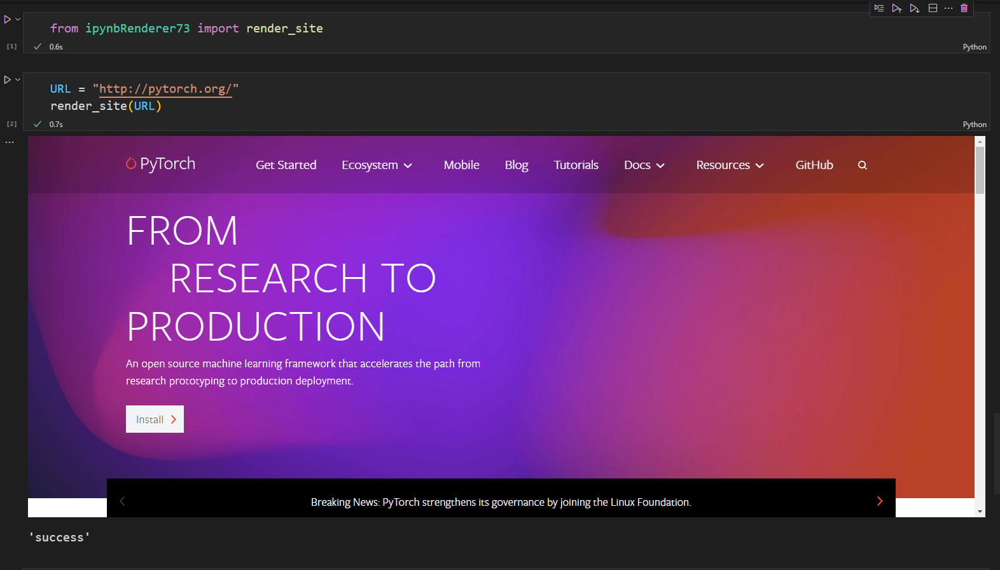

# Project: This is a ipynbRenderer73 Pypi package

This package is meant to render Youtube tutorial videos and reference site into the Colab or Jupyter notebooks for easy reference in future.

PYPI link for this package - [ipynbRenderer73](https://pypi.org/project/ipynbRenderer73/)

# How to run?
## Installation:

#### Create a conda environment

```bash
conda create -n renderer python=3.x -y
```

```bash
conda activate renderer
```

Now install using pip

```bash
pip install ipynbRenderer73
```


# Demo:
## For Youtube videos


## For Websites



