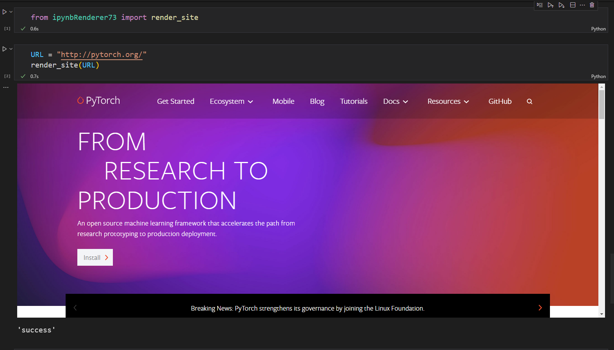

# ipynbRenderer73 

This package is meant to render Youtube tutorial videos and reference site into the Colab or Jupyter notebooks for easy reference in future.

- PYPI link for this package - [ipynbRenderer73](https://pypi.org/project/ipynbRenderer73/)

## Getting Started

### Installation

!!! note "installation steps"
    First let's do an easy pip installation of the library by running the following command -
    ```bash
    pip install ipynbRenderer73
    ```


### Quickstart
Check the short video for quickstart - 

<iframe width="560" height="315" src="https://www.youtube.com/embed/PIzS0OB0qNU" title="YouTube video player" frameborder="0" allow="accelerometer; autoplay; clipboard-write; encrypted-media; gyroscope; picture-in-picture" allowfullscreen></iframe>


# How to run?
## Installation:

#### Create a conda environment

```bash
conda create -n renderer python=3.x -y
```

```bash
conda activate renderer
```

Now install using pip

```bash
pip install ipynbRenderer73
```


# Demo:
## For Youtube videos


## For Websites



